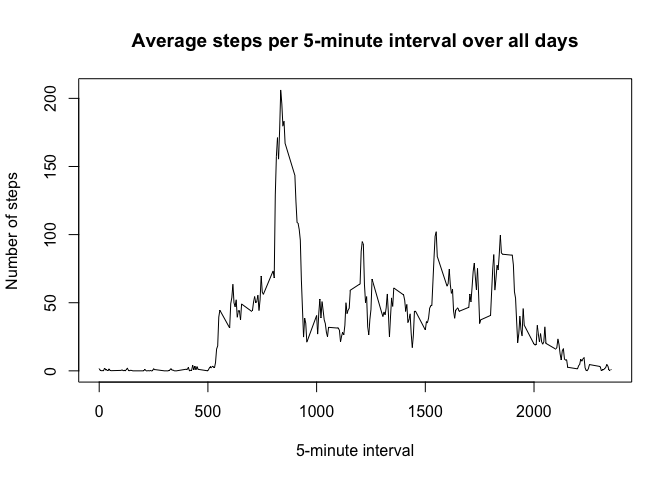

# Reproducible Research: Peer Assessment 1
Jen Becker  
August 7, 2015  


```
## 
## Attaching package: 'dplyr'
## 
## The following objects are masked from 'package:stats':
## 
##     filter, lag
## 
## The following objects are masked from 'package:base':
## 
##     intersect, setdiff, setequal, union
```

### Loading and preprocessing the data

*1. Load the data*

Read the csv file into a data frame.


```r
activity <- read.csv("activity.csv")
```

*2. Process/transform the data into a format suitable for analysis*

Convert the date column into Date objects.


```r
activity$date <- as.Date(activity$date, "%Y-%m-%d")
```

### What is mean total number of steps taken per day?

*1. Calculate the total number of steps taken per day*

Use dplyr to group the data frame by date, then summarize per day.


```r
total_by_date <- 
    activity %>% 
    group_by(date) %>% 
    summarize(daytotal=sum(steps, na.rm=TRUE))
print.data.frame(total_by_date)
```

```
##          date daytotal
## 1  2012-10-01        0
## 2  2012-10-02      126
## 3  2012-10-03    11352
## 4  2012-10-04    12116
## 5  2012-10-05    13294
## 6  2012-10-06    15420
## 7  2012-10-07    11015
## 8  2012-10-08        0
## 9  2012-10-09    12811
## 10 2012-10-10     9900
## 11 2012-10-11    10304
## 12 2012-10-12    17382
## 13 2012-10-13    12426
## 14 2012-10-14    15098
## 15 2012-10-15    10139
## 16 2012-10-16    15084
## 17 2012-10-17    13452
## 18 2012-10-18    10056
## 19 2012-10-19    11829
## 20 2012-10-20    10395
## 21 2012-10-21     8821
## 22 2012-10-22    13460
## 23 2012-10-23     8918
## 24 2012-10-24     8355
## 25 2012-10-25     2492
## 26 2012-10-26     6778
## 27 2012-10-27    10119
## 28 2012-10-28    11458
## 29 2012-10-29     5018
## 30 2012-10-30     9819
## 31 2012-10-31    15414
## 32 2012-11-01        0
## 33 2012-11-02    10600
## 34 2012-11-03    10571
## 35 2012-11-04        0
## 36 2012-11-05    10439
## 37 2012-11-06     8334
## 38 2012-11-07    12883
## 39 2012-11-08     3219
## 40 2012-11-09        0
## 41 2012-11-10        0
## 42 2012-11-11    12608
## 43 2012-11-12    10765
## 44 2012-11-13     7336
## 45 2012-11-14        0
## 46 2012-11-15       41
## 47 2012-11-16     5441
## 48 2012-11-17    14339
## 49 2012-11-18    15110
## 50 2012-11-19     8841
## 51 2012-11-20     4472
## 52 2012-11-21    12787
## 53 2012-11-22    20427
## 54 2012-11-23    21194
## 55 2012-11-24    14478
## 56 2012-11-25    11834
## 57 2012-11-26    11162
## 58 2012-11-27    13646
## 59 2012-11-28    10183
## 60 2012-11-29     7047
## 61 2012-11-30        0
```

*2. Make a histogram of the total number of steps taken each day.*


```r
hist(total_by_date$daytotal, breaks=15, freq=TRUE,
     main="Total steps per day", xlab="Number of steps", ylab="Number of days")
```

 

*3. Calculate and report the mean and median of the total number of steps taken per day.*


```r
mean(total_by_date$daytotal, na.rm=TRUE)
```

```
## [1] 9354.23
```

```r
median(total_by_date$daytotal, na.rm=TRUE)
```

```
## [1] 10395
```

### What is the average daily activity pattern?

*1. Make a time series plot of the 5-minute interval (x-axis) and the average number of steps taken, averaged across all days (y-axis).*


```r
avg_by_interval <-
    activity %>% 
    group_by(interval) %>% 
    summarize(intavg=mean(steps, na.rm=TRUE))
plot(avg_by_interval$interval, avg_by_interval$intavg, type="l", 
     main="Average steps per 5-minute interval over all days",
     xlab="5-minute interval", ylab="Number of steps")
```

 

*2. Which 5-minute interval, on average across all the days in the dataset, contains the maximum number of steps?*


```r
avg_by_interval$interval[which.max(avg_by_interval$intavg)]
```

```
## [1] 835
```

### Imputing missing values

*1. Calculate and report the total number of missing values in the dataset (i.e. the total number of rows with NAs).*


```r
sum(is.na(activity$steps))
```

```
## [1] 2304
```

*2. Devise a strategy for filling in all of the missing values in the dataset.*

I will use the average for that interval.

*3. Create a new dataset that is equal to the original dataset but with the missing values filled in.*

First, copy the dataset so we can manipulate the copy.


```r
activity_noNA <- activity
```

Then, for each row, if the step value is NA, set the step value to the average for that interval as found in the avg_by_interval data frame.


```r
for (i in 1:nrow(activity_noNA)) {
    if (is.na(activity_noNA$steps[i])) {
        activity_noNA$steps[i] <- avg_by_interval$intavg[avg_by_interval$interval == activity_noNA$interval[i]]
    }
}
```

Verify that there are no NAs left.


```r
sum(is.na(activity_noNA$steps))
```

```
## [1] 0
```

*4. Make a histogram of the total number of steps taken each day and calculate and report the mean and median total number of steps taken per day.  Do these values differ from the estimates from the first part of the assignment?  What is the impact of imputing missing data on the estimates of the total daily number of steps?*


```r
total_by_date_noNA <- 
    activity_noNA %>% 
    group_by(date) %>%
    summarize(daytotal=sum(steps))
hist(total_by_date_noNA$daytotal, breaks=15, freq=TRUE,
     main="Total steps each day with estimated data for NA values", 
     xlab="Number of steps", ylab="Number of days")
```

 

```r
mean(total_by_date$daytotal)
```

```
## [1] 9354.23
```

```r
mean(total_by_date_noNA$daytotal) 
```

```
## [1] 10766.19
```

```r
median(total_by_date$daytotal)
```

```
## [1] 10395
```

```r
median(total_by_date_noNA$daytotal)
```

```
## [1] 10766.19
```

The mean and median of the dataset with imputed values do differ from the original dataset.  Imputing data has increased the total daily number of steps, and by using averages to fill in the missing data, we've pulled the entire dataset closer to the average.

### Are there differences in activity patterns between weekdays and weekends?

*1. Create a new factor variable in the dataset with two levels - "weekday" and "weekend" indicating whether a given date is a weekday or weekend day.*


```r
activity_noNA <- mutate(activity_noNA, 
                        day=ifelse(weekdays(date) %in% c("Saturday", "Sunday"),
                                   "weekend",
                                   "weekday"))
activity_noNA$day <- factor(activity_noNA$day)
```

*2. Make a panel plot containing a time series plot of the 5-minute interval (x-axis) and the average number of steps taken, averaged across all weekday days or weekend days (y-axis).*


```r
t <- activity_noNA %>%
    group_by(day, interval) %>%
    summarize(m=mean(steps))
xyplot(m~interval|day, data=t, type="l")
```

 
